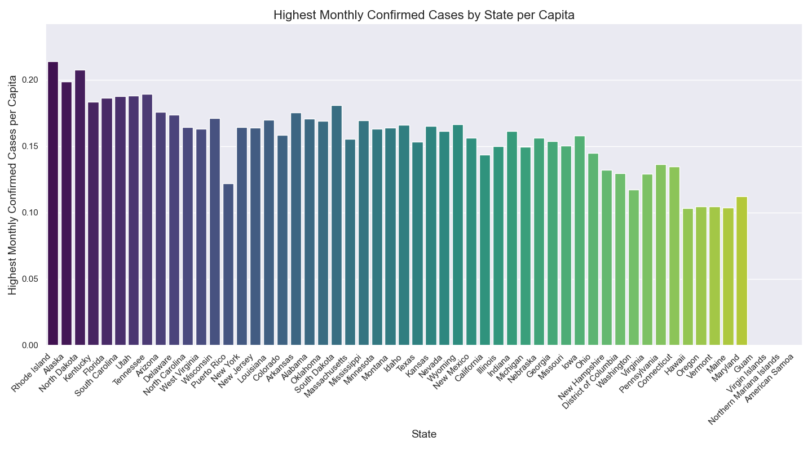
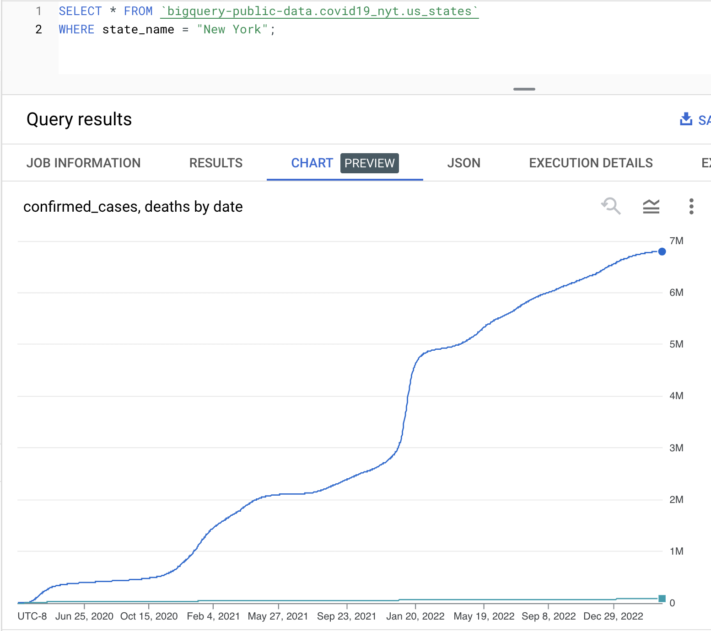
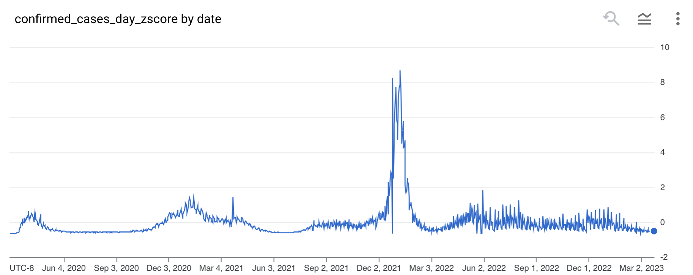
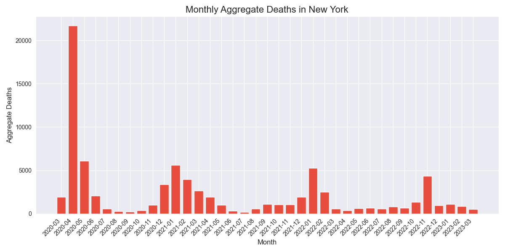
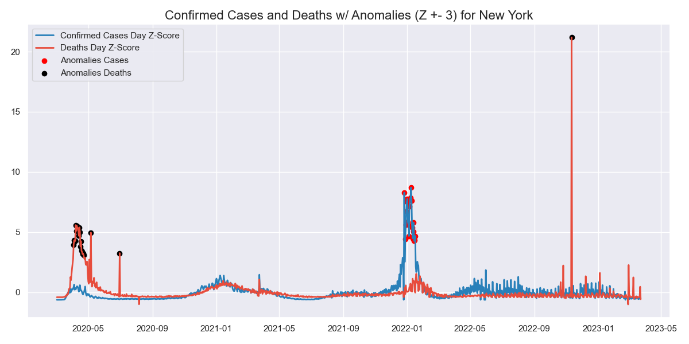
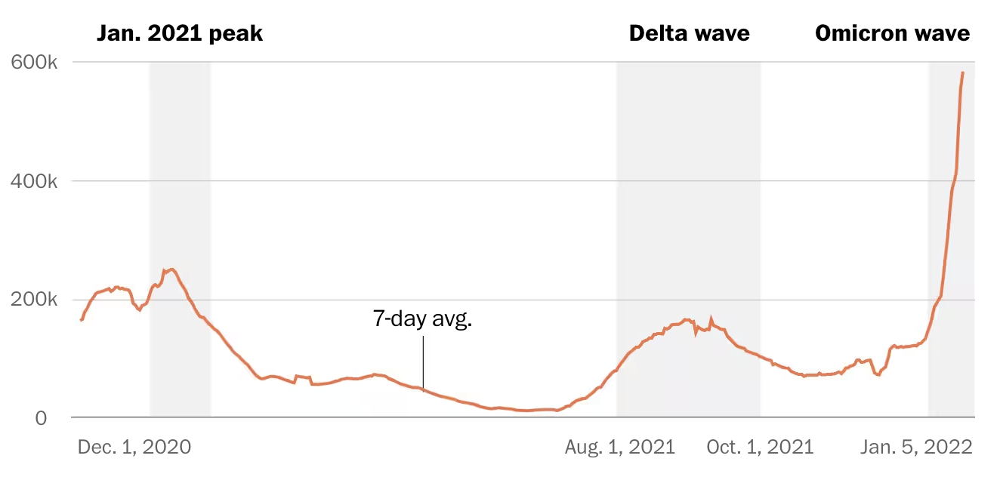

# Analysis Assignment

## Introduction

This document outlines the approach and findings of the Analysis Assignment using a COVID-19 dataset from the New York Times, as available on Google's SQL platform BigQuery.

## Objective

The main tasks of this assignment are:

1. Writing SQL queries to filter and compute metrics at the level of each US state and date.
2. Conducting exploratory analysis to uncover interesting patterns and visualizations.

## Setup

- Get a Google BigQuery account, create a project.
- Load the `bigquery-public-data.covid19_nyt` dataset and its `us_states` table.

## Part 1: SQL Queries

#### 1.a

`confirmed_cases_zscore`: Calculates the Z-Score of confirmed COVID-19 cases for each row against the entire dataset.

Z-score is calculated as the: `(value - mean) / standard deviation`. To get mean and standard deviation in SQL, you use the `AVG()` and `STDDEV()` functions with the `OVER` clause. OVER () is a window function that does the entire dataset, because of empty parens.

```sql
SELECT 
  date, 
  state_name, 
  confirmed_cases, 
  deaths,
  (
   (confirmed_cases - (AVG(confirmed_cases) OVER())) 
   / STDDEV(confirmed_cases) OVER()) 
   AS confirmed_cases_zscore
FROM `bigquery-public-data.covid19_nyt.us_states`;
```

Note: this z-score is not helpful at the "granularity of a single state and date", because it just gets bigger over time, confirmed_cases obviously being cumulative. Additional analysis in exploratory step.

------
   
#### 1.b

`confirmed_cases_zscore_state`: Calculates the Z-Score of confirmed cases normalized based on the state.

To calculate the AVG and STDDEV for each state separately, you use the `PARTITION BY` clause. Essentially grouping them before performing the window function.

```sql
SELECT 
  date, 
  state_name, 
  confirmed_cases, 
  deaths,
  (
   (confirmed_cases - (AVG(confirmed_cases) OVER(PARTITION BY state_name))) / 
   STDDEV(confirmed_cases) OVER(PARTITION BY state_name)
  )
  AS confirmed_cases_zscore_state
FROM `bigquery-public-data.covid19_nyt.us_states`;
```

------

#### 1.c

`highest_monthly_confirmed_cases`: Identifies the highest number of confirmed cases in a month for each state.

I need to pull the month and year out of date. I can use the `EXTRACT()` function to do this. Then I can use the `MAX()` function with the `OVER` clause to get the highest number of confirmed cases in a month for each state.
   
```sql
SELECT
    state_name,
    date,
    EXTRACT(YEAR FROM date) AS year,
    EXTRACT(MONTH FROM date) AS month,
    MAX(confirmed_cases) OVER (
        PARTITION BY state_name, EXTRACT(YEAR FROM date), EXTRACT(MONTH FROM date)
    ) AS highest_monthly_confirmed_cases
FROM 
    `bigquery-public-data.covid19_nyt.us_states`;
```

Note, this is still not too useful as highest_monthly_confirmed_cases is on each of the 60,000 rows. Tried adding a GROUP BY, but that errored. Haven't figured out how to do this in SQL alone yet.

However, I did additional analysis in exploratory step to get this neat chart. It uses the above query, but then uniques it per state, and then I divide that by the population of the state to get a per capita number. This is a much more useful metric.

> 

------

#### 1.d

`confirmed_cases_per_death`: Computes the ratio of confirmed cases to deaths.

Use CASE like a switch statement to prevent divide by zero errors.

```sql
SELECT
    state_name,
    date,
    confirmed_cases,
    deaths,
    CASE 
        WHEN deaths = 0 THEN NULL
        ELSE confirmed_cases / deaths
    END AS confirmed_cases_per_death
FROM
   `bigquery-public-data.covid19_nyt.us_states`;
```

This ratio cound be useful for comparing the severity of the virus in different states. A high ratio means more people are recovering.

## Part 2: Exploratory Analysis

### Exploration 1: Cumulative vs. Daily Differences

First thing I noticed from looking at the data is that confirmed_cases and deaths almost always go up, and thus are most likely cumulative instead of daily. This is confirmed by the chart below. I say almost always because there are a few instances where the number goes down, which is probably due to data corrections.

> 

To do a more useful analysis, I need new columns, `confirmed_cases_day` and `deaths_day`, which are the difference between the current day and the previous day. `LAG` is a window function that gets the value from the previous row. These need to be partitioned by state and ordered by date. Then I can re-do the Z-scores.

I'll use a `WITH` to create a temporary table, `us_states_day`, that has the new columns. Can use `NULLIF` also to prevent divide by zero errors.


```sql
WITH us_states_day AS (
  SELECT
      state_name,
      date,
      confirmed_cases,
      deaths,
      confirmed_cases - LAG(confirmed_cases) OVER (PARTITION BY state_name ORDER BY date) AS confirmed_cases_day,
      deaths - LAG(deaths) OVER (PARTITION BY state_name ORDER BY date) AS deaths_day
  FROM
     `bigquery-public-data.covid19_nyt.us_states`
)
  SELECT
      date,
      state_name,
      confirmed_cases,
      deaths,
      confirmed_cases_day,
      deaths_day,
      (
         (confirmed_cases_day - AVG(confirmed_cases_day) OVER (PARTITION BY state_name))
         / NULLIF(STDDEV(confirmed_cases_day) OVER (PARTITION BY state_name), 0)
      ) AS confirmed_cases_day_zscore,
  FROM
      us_states_day
  WHERE state_name = "New York"
  ORDER BY date;
```

This provides a much more useful chart:

> 

### Exploration 2: COVID Deaths Timeline In Python Pandas w/ Additional Data for Population

I wrote code in the [bq_c19.py](bq_c19.py) file to generate charts. It connects to my personal Google Cloud account and pulls the data from BigQuery using SQL. I used the libraries `pandas`, `matplotlib`, and `seaborn` to generate the charts. I also pulled data in for population from a US Census Bureau API.

---

#### 2.a

Monthly aggregate deaths in NY appears to show a seasonal trend with more deaths in winter and spring. With a very large spike in April 2020, which I'm sure we all remember. That's actually when my sister bailed NYC and came home because it was getting crazy.

> )

---

#### 2.b

The day 2022-11-11 in NY had a very high spike in cases. There may be a narrative behind this to explore and we may want to remove it from the dataset / replace it with a median value. It's unlikely for something **20** standard deviations away from the mean to happen.

> 

The case spikes labeled as anomaly at the end of 2021 and beginning of 2022 could be due to virus evolution. I found an [article](https://www.washingtonpost.com/health/interactive/2022/omicron-comparison-cases-deaths-hospitalizations/) with a chart where these dates overlap with the onset of the Omicron variant: 

> 

---

## Conclusion

In this assignment, my approach was twofold: first, I crafted SQL queries to calculate critical metrics such as Z-scores and case-to-death ratios, ensuring I adhered to the stipulation calculating it all in SQL. 

I then did exploratory analysis, employing Python data manipulation and visualization libraries to reveal underlying trends and anomalies in the data, particularly focusing on the state of New York. The visualizations highlighted significant variations that could be linked to specific events or seasonal patterns. 

The analysis could be extended by incorporating additional datasets, such as vaccination rates, to determine the impact of vaccination on the severity of the virus.

Creating an interactive dashboard, perhaps using technologies like D3.js, could be another good exercise to allow users to explore the data and draw their own conclusions.